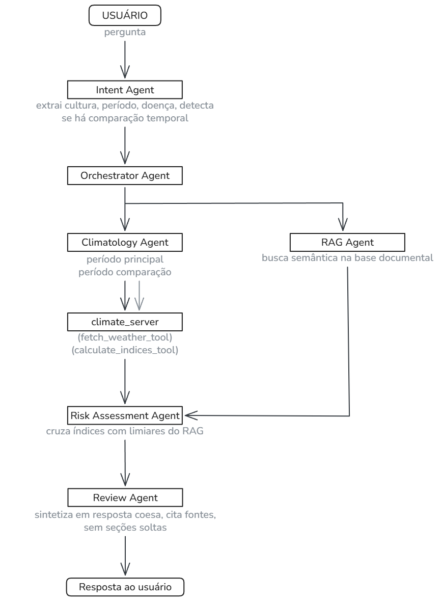

<table>
<tr>
<td width="120">


</td>
<td>

# Assistente Agroclimático Multiagente
</table>

Projeto final de Inteligência Artificial: um sistema multiagente com LLMs locais (Ollama),
RAG e MCP para apoio à decisão agroclimática (trigo/soja) na região de Passo Fundo (RS).

## Equipe

- Fernanda Japur Ihjaz
- Maria Eduarda Schell

## Problema escolhido

Produtores rurais e técnicos agrícolas precisam cruzar continuamente dados meteorológicos com
recomendações agronômicas para tomar decisões sobre manejo das culturas. Embora os dados
climáticos do INMET estejam disponíveis, sua interpretação exige consultar manualmente
boletins técnicos, zoneamentos e publicações da Embrapa — um processo demorado e sujeito a
erros humanos.

A proposta é um **assistente agroclimático** que recebe uma pergunta em linguagem natural e produz uma **análise técnica
fundamentada**, integrando série histórica do INMET, índices agroclimáticos calculados
automaticamente e trechos recuperados da base documental.

## Objetivo da solução

Entregar, via terminal, uma resposta fundamentada que seja:

- **contextualizada**: extrai automaticamente cultura, período e intenção da pergunta em linguagem natural;
- **especializada**: agentes distintos cuidam de climatologia, risco e revisão final;
- **comparativa**: quando a pergunta menciona dois períodos, busca e confronta os dados de
  ambos;
- **local e privada**: roda inteiramente com modelos locais (Ollama), sem enviar dados a APIs
  externas.

## Arquitetura multiagente

O sistema utiliza uma arquitetura sequencial: a saída de cada etapa vira contexto da
seguinte. Um agente de intenção resolve automaticamente os parâmetros da consulta antes de
acionar a cadeia de análise.



### Agentes

| Agente | Responsabilidade | Ferramentas |
|--------|-----------------|-------------|
| **IntentAgent** | Interpreta a pergunta e extrai: cultura, data início/fim, doença mencionada e se há pedido de comparação temporal | — |
| **OrchestratorAgent** | Coordena a cadeia de agentes usando os parâmetros extraídos pelo IntentAgent; parâmetros explícitos da CLI têm prioridade sobre os inferidos | — |
| **ClimatologyAgent** | Consulta a série histórica do INMET, calcula índices agroclimáticos e interpreta os resultados | `fetch_weather_tool`, `calculate_indices_tool` |
| **RAGAgent** | Recupera trechos relevantes da base documental via busca semântica, retornando texto e citação de fonte | `vector_search` |
| **RiskAssessmentAgent** | Cruza índices calculados com limiares técnicos recuperados pelo RAG e determina o nível de risco (baixo / moderado / alto / inconclusivo) | — |
| **ReviewAgent** | Sintetiza todas as entradas em uma resposta coesa em prosa; detecta automaticamente se os índices chegaram vazios e informa claramente ao usuário | — |

## Ferramentas (tools)

As ferramentas são acionadas pelos agentes via MCP:

- **`fetch_weather_tool`** — consulta a série horária tratada do INMET filtrada por período e
  estação. Descobre dinamicamente as colunas disponíveis no parquet (temperatura, precipitação,
  umidade), sem depender de nomes fixos de colunas. Implementação: `src/tools/climate_tool.py`.
- **`calculate_indices_tool`** — calcula índices agroclimáticos a partir da série retornada:
  graus-dia acumulados, horas de frio abaixo de 7,2 °C, precipitação acumulada e índice
  composto de risco de doenças (umidade > 90% e temperatura entre 15–30 °C).
  Implementação: `src/tools/indices_tool.py`.
- **`vector_search`** — faz busca semântica (RAG) na base vetorial de documentos técnicos,
  retornando os trechos mais relevantes com fonte e página. Implementação:
  `src/tools/rag_tool.py`.


## MCP (Model Context Protocol)

O MCP padroniza e desacopla o acesso dos agentes aos recursos externos.

- **Servidor MCP** — `src/mcp_servers/climate_server.py`, construído com `FastMCP`, expõe
  `fetch_weather_tool` e `calculate_indices_tool` por **transporte stdio**.
- **Comunicação** — o `ClimatologyAgent` sobe o servidor MCP como subprocesso a cada
  chamada, via `stdio_client` do SDK MCP. Os agentes não importam as ferramentas diretamente:
  invocam-nas pelo protocolo, o que permite substituir ou escalar o servidor sem alterar a
  lógica dos agentes.


## RAG (Retrieval-Augmented Generation)

Antes de emitir qualquer parecer, o `RAGAgent` consulta a base vetorial, recupera os trechos
mais relevantes para a pergunta e os fornece como contexto fundamentado ao `RiskAssessmentAgent`
e ao `ReviewAgent`. Isso impede que o modelo produza recomendações baseadas apenas em
conhecimento paramétrico.

**Fluxo:** identificar tema da pergunta → enriquecer a query com cultura e doença detectadas →
buscar no vectorstore → retornar trechos com citação `[arquivo, página X]` → inserir no
contexto da avaliação de risco.

### Base de conhecimento

- **Origem:** documentos públicos da Embrapa Trigo, Zoneamento Agrícola de Risco Climático
  (ZARC), Indicações Técnicas para Trigo e Soja, boletins sobre geada e doenças das culturas.
- **Formato de entrada:** PDFs organizados em `data/docs/`, por categoria de assunto.
- **Ingestão:** cada PDF é convertido em texto, dividido em chunks de 300 palavras (overlap
  de 50) e indexado no ChromaDB com embeddings gerados pelo Ollama.

### Embeddings e armazenamento vetorial

- **Embeddings:** modelo local **`nomic-embed-text`** servido pelo Ollama.
- **Banco vetorial:** **ChromaDB** (`PersistentClient`), persistido em `data/vectorstore/`,
  coleção `agroclimate_knowledge_base`.
- **Recuperação:** busca vetorial + MMR para diversidade + reranking com
  `cross-encoder/ms-marco-MiniLM-L-6-v2` (com fallback por cosseno em caso de memória
  insuficiente).

## Modelo local e forma de execução

- **LLM dos agentes:** **`qwen2.5:7b`** (via Ollama), escolhido por equilibrar qualidade de
  raciocínio e custo de processamento em máquina local.
- **Modelo de embeddings:** **`nomic-embed-text`** (via Ollama).
- **Execução:** os modelos rodam localmente; nenhum dado sai da máquina.

## Dependências do projeto

- Python 3.12
- [Ollama](https://ollama.com) instalado e em execução
- Pacotes Python (ver `requirements.txt`):
  - `mcp` — SDK do Model Context Protocol
  - `chromadb` — banco vetorial
  - `ollama` — cliente Python do Ollama
  - `sentence-transformers` — reranking com CrossEncoder
  - `pandas`, `pyarrow` — processamento da série histórica do INMET
  - `pypdf` — extração de texto dos PDFs
  - `typer` — interface de linha de comando
  - `python-dotenv`

---

## Instalação

```bash
git clone https://github.com/fernanda-ihjaz/multiagent-agroclimate-assistant.git
cd multiagent-agroclimate-assistant

python -m venv venv
venv\Scripts\activate          # Windows
# source venv/bin/activate     # Linux/Mac

pip install -r requirements.txt
```

### Configuração

1. Crie um arquivo `.env` na raiz do projeto (caso necessário para configurações futuras).

2. Instale e inicie o Ollama:

```bash
ollama serve
```

3. Em outro terminal, baixe os modelos utilizados pelo projeto:

```bash
ollama pull llama3.2
ollama pull nomic-embed-text
```

4. Verifique se os modelos estão disponíveis:

```bash
ollama list
```

> **Importante:** o comando `ollama serve` deve permanecer em execução enquanto o assistente estiver sendo utilizado, pois tanto a geração de respostas quanto os embeddings dependem da API local do Ollama.

### Indexação da base de conhecimento (RAG)

Indexe os PDFs de `data/docs/` no banco vetorial. Execute uma vez:

```bash
python main.py indexar
```

## Como usar

```bash
python main.py perguntar "<pergunta>"
```

Os parâmetros de cultura, período e comparação são inferidos automaticamente da pergunta.
É possível sobrescrevê-los via flags:

| Flag | Descrição | Padrão |
|------|-----------|--------|
| `--cultura` / `-u` | Força a cultura: `trigo` ou `soja` | inferido da pergunta |
| `--inicio` / `-i` | Força a data de início (`YYYY-MM-DD`) | inferido da pergunta |
| `--fim` / `-f` | Força a data de fim (`YYYY-MM-DD`) | inferido da pergunta |
| `--estacao` / `-e` | Nome da estação INMET | `PASSO FUNDO` |
| `--categoria` / `-c` | Filtro RAG: `frost`, `soy`, `wheat`, `zarc` | sem filtro |
| `--top-k` / `-k` | Trechos recuperados pelo RAG | `5` |
| `--risco` / `--sem-risco` | Inclui ou omite avaliação de risco | incluído |

### Exemplos de uso

```bash
python main.py perguntar "Quais são os principais fungicidas recomendados para o controle de ferrugem asiática na soja?"

python main.py perguntar "Como foi o acúmulo de horas de frio?" --cultura trigo --inicio 2024-07-01 --fim 2024-07-31

python main.py perguntar "Quais são os sintomas visuais da giberela no trigo?" --sem-risco
```

Saída (resumida):

```
2026-06-27 20:34:45 | INFO    | NOVA EXECUÇÃO
2026-06-27 20:34:45 | INFO    | Log: 2026-06-27_20-34-45.txt

2026-06-27 20:34:45 | INFO    | Pergunta : Quais são os sintomas visuais da giberela no trigo?

2026-06-27 20:34:45 | INFO    | Estação  : PASSO FUNDO
2026-06-27 20:34:45 | INFO    | Início: Execução completa da consulta
2026-06-27 20:35:09 | INFO    | Fim: Execução completa da consulta (23.767s)
2026-06-27 20:35:09 | INFO    | Resposta gerada: 1167 caracteres

A giberela é uma doença causada pelo fungo Mycosphaerella fagacearum que afeta o trigo, sendo mais comum em regiões com temperaturas elevadas e umidade alta. Em Passo Fundo, durante o período de 2024-06-01 a 2024-06-30, as condições climáticas foram favoráveis para o desenvolvimento da doença.

Os sintomas visuais da giberela no trigo incluem espiguetas de coloração esbranquiçada ou cor de paleta, aristas das espiguetas desviam do sentido normal e pedúnculo com coloração amarronzada. Além disso, o branqueamento de todas as espiguetas da porção superior da espiga é um sinal claro de infecção, com a ráquis da espiga afetada apresentando coloração escura (marrom) na região das espiquetas sadias. De acordo com o documento [trigo_produtor_pergunta_embrapa_r.pdf, página 153], os grãos oriundos da parte esbranquiçada da espiga são chochos, enrugados e de cor branquorosa a parda clara.

É importante notar que a giberela pode ser controlada com medidas preventivas, como o uso de fungicidas e a implementação de práticas culturais adequadas. No entanto, é fundamental identificar os sintomas visuais da doença para tomar medidas eficazes de controle e prevenção.
```

---

## Estrutura do projeto

```
multiagent-agroclimate-assistant/
│
├── main.py                        # CLI e ponto de entrada
├── config.py
├── requirements.txt
│
├── data/
│   ├── docs/                      # PDFs da base documental (por categoria)
│   ├── inmet/                     # Série histórica do INMET (parquet)
│   └── vectorstore/               # Banco vetorial ChromaDB
│
├── scripts/
│   └── index_knowledge_base.py    # Ingestão de PDFs no ChromaDB
│
└── src/
    ├── agents/
    │   ├── intent_agent.py
    │   ├── orchestrator.py
    │   ├── climatology_agent.py
    │   ├── rag_agent.py
    │   ├── risk_assessment_agent.py
    │   └── review_agent.py
    │
    ├── llm/
    │   └── ollama_client.py
    │
    ├── mcp_servers/
    │   └── climate_server.py
    │
    ├── rag/
    │   ├── embeddings.py
    │   ├── loader.py
    │   └── retriever.py
    │
    └── tools/
        ├── climate_tool.py
        └── indices_tool.py
```

---

## Limitações

- Utiliza apenas dados históricos do INMET — não realiza previsão meteorológica.
- A qualidade da análise depende da cobertura da base documental indexada.
- Não substitui a avaliação de um engenheiro agrônomo.
- Atualmente contempla trigo e soja na região de Passo Fundo (RS).
- A interpretação automática dos parâmetros da análise climática ainda está em estágio de desenvolvimento.